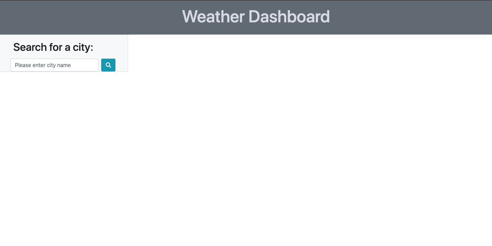
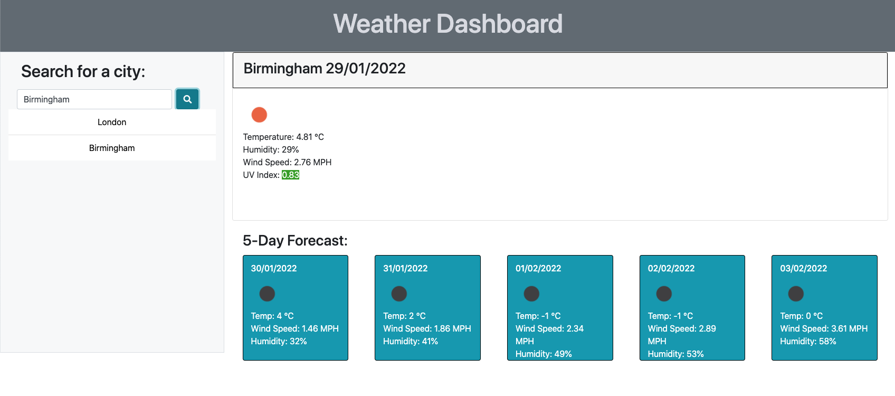
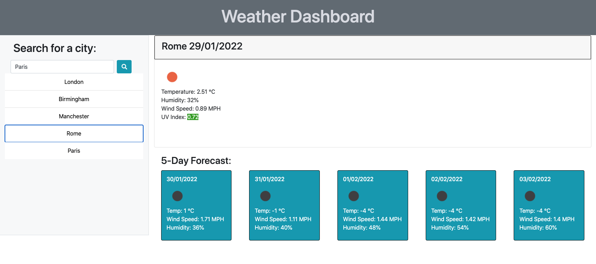
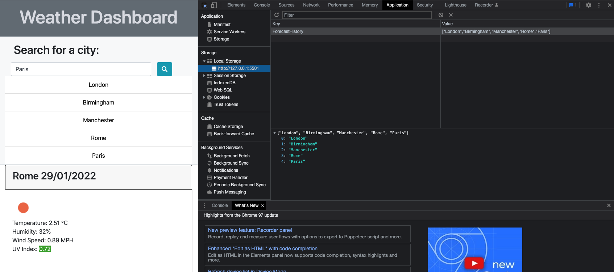

# Weather Dashboard

## Description

- I have been tasked to create a weather dashboard to display the weather outlook for multiple cities and offer the current weather conditions as well as the weather forecast for the subsequent 5 days.

## Acceptance Criteria - Checklist

- The user can input a city of their choice into the input field and click the search button to bring up the current and future weather conditions for that city.

- The user at this stage can see the name of the chosen city, the date, an icon representing the weather conditions, the temperature, the humidity, the wind speed and the UV index.

- The levels of UV are categorised over 5 levels. Dependent on the level of UV within that chosen city, the UV index number is displayed on a colour according to its severity.

- The 5-day forecast also displays to the user the date, an icon to represent the current weather conditions, temperature, wind speed and levels of humidity.

- The user is also able to view a list of the searches that they have made on the deployed site and if they wish they are able to click on a city in the search history to present them once again with the current and future weather conditions.

---

## Screenshot of deployed application

Weather Dashboard - city search.

Weather dashboard displaying current and future conditions.

City search history populating.

Clicking on a city in the search history to display weather conditions once again.

Weather dashboard displaying saved data in local storage.

---

## The URL of the deployed application

https://riz1ash786.github.io/weather-dashboard/

## The URL of the GitHub repository

https://github.com/riz1ash786/weather-dashboard
